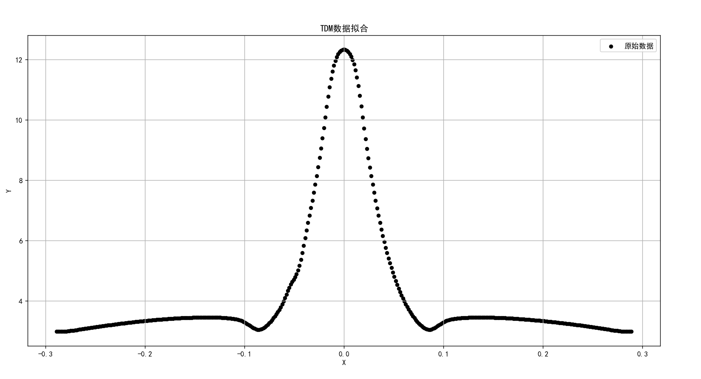
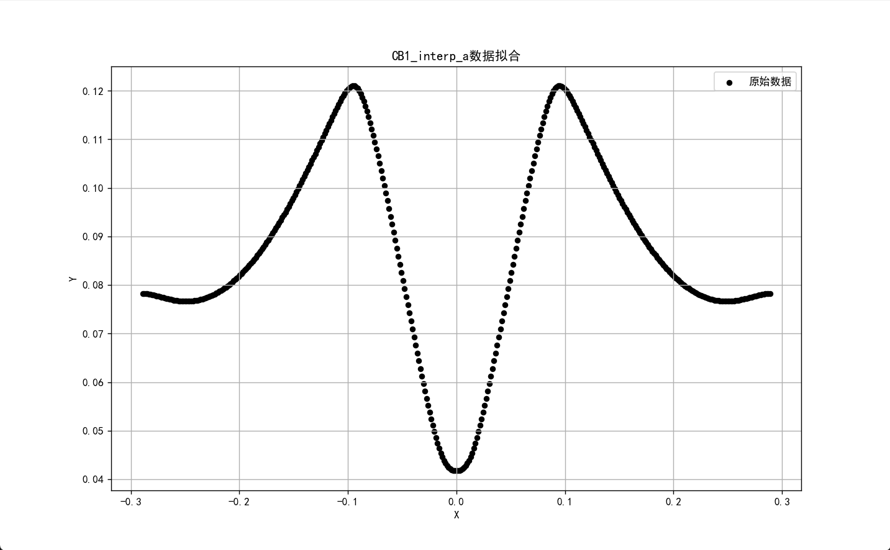

# Data Point Fitting Curve

将离散数据点拟合成连续曲线，并对不同方法的效果做直观比较。

本仓库目前围绕两组实验数据，分别尝试了多项式、分段函数、傅里叶级数和高斯组合等方式进行拟合。每种方法都会输出拟合图和 `txt` 结果，便于观察曲线形状、函数表达式和拟合误差。

## 数据说明

- `data/1_TDM.txt`
  第一列为 `x`，第二列为 `y`
- `data/2_x.txt` 与 `data/2_CB1_interp_a.txt`
  分别对应第二组数据的横纵坐标

## 原始数据

## 当前拟合方法

- 多项式拟合
- 分段函数拟合
- 傅里叶级数拟合
- 三高斯组合拟合
- 五高斯组合拟合

对应结果输出在 `output/` 目录下，包含：

- 拟合结果图片 `png`
- 公式或表达式说明 `txt`
- 拟合精度指标：`MSE`、`RMSE`、`MAE`、`R^2`

## 关于傅里叶级数画图的额外尝试

除了用于数据曲线拟合，本仓库也开始尝试把傅里叶级数用于简单轮廓的重建与绘制。
思路是先将轮廓表示为一组离散点，再分解成不同频率的正弦/余弦分量，用动画方式逐步把图形“画出来”。

这部分目前仍是实验性质，但它说明了一件很有意思的事：傅里叶级数不仅能拟合曲线，也能表达和重建图形。
